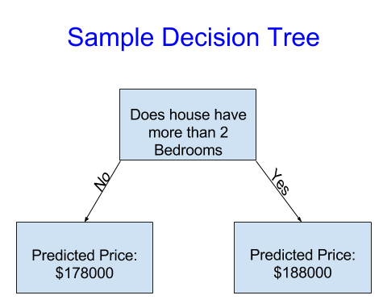

## Member Info
<ul>
    <li> Ruokun Niu rniu8@gatech.edu </li>
    <li> Yisu Ma yma391@gatech.edu</li>
    <li> Jiayuan Fu jfu94@gatech.edu</li>
    <li> Yangxiaojun Zhang yzhang3449@gatech.edu </li>
    <li> Zhiyi Li zli879@gatech.edu </li>
</ul>

## Project proposal
### **Background**
It is undoubtedly that investment in the real estate industry has proven to be lucrative in the past decade. For many who are purchasing properties for personal uses instead of investing, the continual rise in housing prices throughout the country is a daunting factor. Additionally, many home-buyers either do not have access to comprehensive information of the properties in a given region, or, more commonly, does not have the knowledge or ability to utilize such data to perform rational analysis.\
As a group of undergraduate students who have obtained some knowledge in Machine Learning from CS 4641 and are about to graduate from university, we will soon encounter the challenge of selecting a desired property to rent/purchase. We are aiming to create a ML model that can accurately approximate the pricing for a house, given a set of information of the property (e.g location, size, # of bedrooms and etc.)

### **Dataset**
A link to the dataset that we will be using can be found [here](https://www.kaggle.com/c/house-prices-advanced-regression-techniques/data). Kaggle is an online community designed for data scientists and ML engineers. We will be using the data that is provided by Kaggle for one of its online competitions. The dataset contains 81 columns,or features. Since we are trying to predict the price of a given property, we will set SalePrice as the label for our dataset. Each datapoint also has an unique id. The remaining columns describe the conditions, locations and other characteristics of a given property. A detailed text file describing each of the features can be found [here](./data_description.txt). Other than the training data, Kaggle also provides a set of data for testing the accuracy. 

### **Model**
The team is initially thinking about using a decision tree as our starting model choice. A decision tree is composed of a series of decisions that are made based on the features of the input dataset. At a given node in the decision tree, we will make a certain decision and traverse to the correct child of the current node based on the current value of the feature. For instance, as shown in the image below, if the current house has more than two bedrooms, we will predict a higher price for the property, vice versa. 

A decision tree is a good starting point since it is relatively easy to implement and is comparatively less time-consuming. It is also effective at working with a large set of data. However, it does face the challenge of overfitting.\
Another method that we can use is a random forest. Insteading making decisions based on one feature, random forest makes a decision based on several features by constructing several decision trees at the same time. According to research, random forests often generate more accurate results than decision trees, but constructing this model can be complex and the model can be time-expensive to run. The team will focus on implementing the decision tree model first.

### **Timeline**
The proposed timeline for our project can be found [here](https://docs.google.com/spreadsheets/d/1HgDW0TEw8-GEcRAKyIbo_yfdCsxbFsD4RhGat9NKrLE/edit#gid=0)

### [**Proposal Video**](https://youtu.be/sBiR_8SUITI)
### **References**:

- https://www.seattletimes.com/business/real-estate/five-takeaways-from-seattles-red-hot-2021-housing-market/#:~:text=The%20median%20price%20in%20Seattle,for%20%24650%2C000%2C%20up%2022.6%25
- https://www.kaggle.com/c/house-prices-advanced-regression-techniques/data 
- https://www.upgrad.com/blog/random-forest-vs-decision-tree/#:~:text=A%20decision%20tree%20combines%20some,forest%20model%20needs%20rigorous%20training
- https://medium.com/@feng.cu/machine-learning-decision-tree-model-example-melbourne-house-price-prediction-83a22d16e50

