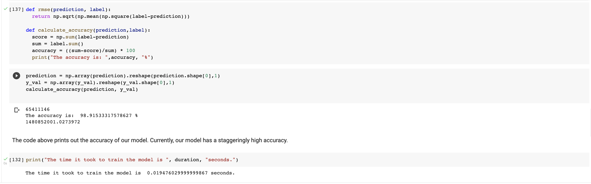

## Member Info
<ul>
    <li> Ruokun Niu rniu8@gatech.edu </li>
    <li> Yisu Ma yma391@gatech.edu</li>
    <li> Jiayuan Fu jfu94@gatech.edu</li>
    <li> Yangxiaojun Zhang yzhang3449@gatech.edu </li>
    <li> Zhiyi Li zli879@gatech.edu </li>
</ul>


## Project proposal
### **Background**
It is undoubtedly that investment in the real estate industry has proven to be lucrative in the past decade. For many who are purchasing properties for personal uses instead of investing, the continual rise in housing prices throughout the country is a daunting factor. Additionally, many home-buyers either do not have access to comprehensive information of the properties in a given region, or, more commonly, does not have the knowledge or ability to utilize such data to perform rational analysis.\
As a group of undergraduate students who have obtained some knowledge in Machine Learning from CS 4641 and are about to graduate from university, we will soon encounter the challenge of selecting a desired property to rent/purchase. We are aiming to create a ML model that can accurately approximate the pricing for a house, given a set of information of the property (e.g location, size, # of bedrooms and etc.)

### **Dataset**
A link to the dataset that we will be using can be found [here](https://www.kaggle.com/c/house-prices-advanced-regression-techniques/data). Kaggle is an online community designed for data scientists and ML engineers. We will be using the data that is provided by Kaggle for one of its online competitions. The dataset contains 81 columns,or features. Since we are trying to predict the price of a given property, we will set SalePrice as the label for our dataset. Each datapoint also has an unique id. The remaining columns describe the conditions, locations and other characteristics of a given property. A detailed text file describing each of the features can be found [here](./data_description.txt). Other than the training data, Kaggle also provides a set of data for testing the accuracy. 

### **Model**
The team is initially thinking about using a decision tree as our starting model choice. A decision tree is composed of a series of decisions that are made based on the features of the input dataset. At a given node in the decision tree, we will make a certain decision and traverse to the correct child of the current node based on the current value of the feature. For instance, as shown in the image below, if the current house has more than two bedrooms, we will predict a higher price for the property, vice versa. 


A decision tree is a good starting point since it is relatively easy to implement and is comparatively less time-consuming. It is also effective at working with a large set of data. However, it does face the challenge of overfitting.\
Another method that we can use is a random forest. Insteading making decisions based on one feature, random forest makes a decision based on several features by constructing several decision trees at the same time. According to research, random forests often generate more accurate results than decision trees, but constructing this model can be complex and the model can be time-expensive to run. The team will focus on implementing the decision tree model first.

### **Timeline**
The proposed timeline for our project can be found [here](https://docs.google.com/spreadsheets/d/1HgDW0TEw8-GEcRAKyIbo_yfdCsxbFsD4RhGat9NKrLE/edit#gid=0)


### [**Proposal Video**](https://youtu.be/sBiR_8SUITI)
### **References**:

- https://www.seattletimes.com/business/real-estate/five-takeaways-from-seattles-red-hot-2021-housing-market/#:~:text=The%20median%20price%20in%20Seattle,for%20%24650%2C000%2C%20up%2022.6%25
- https://www.kaggle.com/c/house-prices-advanced-regression-techniques/data 
- https://www.upgrad.com/blog/random-forest-vs-decision-tree/#:~:text=A%20decision%20tree%20combines%20some,forest%20model%20needs%20rigorous%20training
- https://medium.com/@feng.cu/machine-learning-decision-tree-model-example-melbourne-house-price-prediction-83a22d16e50


## Project Midterm Report
### Part 1: Importing the dataset and the required packages
#### Importing all of the packages

#### Forming the dataset into pandas dataframes

#### Overall Price Distribution (Shown in a histogram):


### Part 2: Data Cleaning and Feature Examination using EDA

#### 2.1 Checking for NaNs
For many of the features in our training dataset, there exist multiple NaNs throughout the dataset. However, for our dataset, a value of NaN does not mean an absence of data in every case.
In fact, depending on the feature/column, a value of NaN can either be a valid value, or can represent the absence of valid data. For instance, for the "PoolQC" (the pool quality feature), if the property does not contain a pool, then a value of NA will be used, highlighting the fact that this feature is not applicable. However, for some other features, NaN indicates the a value is missing. The code below prints all of the columns that contain a NaN value somewhere and the exact number of NaN values that the column contains. 
 

Through manul inspection, we have created a dictionary for filling the missing information in our dataset. The keys to this dictionary are the column names in the dataset (only the ones that contain a NaN somewhere, and the values are the values that will replace the NaN.

For columns that contain purely numerical value, e.g. LotFrontage, a missing value, or Nan, will be replaced with 0. For Categorical columns that contain strings as values, NaN will be replaced by a short description of the type of feature that is missing for this column. 


As shown in the code above, we are able to fill in the missing values in our training dataset. 
#### 2.2 Feature Engineering using EDA
** Used the information/tutorial from this [site](https://towardsdatascience.com/visualizing-your-exploratory-data-analysis-d2d6c2e3b30e) **

EDA stands for Exploratory Data Analysis and it is a data analysis approach that examines the relationship between the features. Since our dataset contains a lot of columns, it might be useful for us to examine the correlation/importance of every feature and drop the features that do not play a significant role in housing-price prediction. 

This is a valid and essential approach as it reduces the complexity of our dataset (ultimately our models as well). Additionally, in reality, some features (e.g. number of bedrooms) of a house weigh more to the buyers than some other features (e.g. number of elevators).

The easiest way to visualize the correlation between the features is to use Sns' heatmap, which presents the correlation as a heatmap matrix. The code snippet below performs this function.
```python
{
    plt.figure(figsize=(20, 32))
    sns.heatmap(housing_df.corr(), annot_kws={"size": 8}, annot = True)
}
```


In the heat map above, a positive correlation is represented in lighter colors, whereas a negeative coorrelation is represented in the darker ones.

We now need to examine the correlation between the features and the label, SalePrice:


An easy way to reduce the number features in our dataset is to simply select two numerical thresholds, and only select the features where their correlations with the sale price (the absolute value) is within this boundary. For the initial attempt, we will set the minimum threshold to be 0.10 and the maximum threshold to be 0.90.

We are able reduce from 81 columns (1 of the column is the label) into 25 columns. Notice that for our reduced dataset (train_X), all 25 columns are valid features. We are now able to proceed with building our model.

### Part 3: Decision Tree

At this point of the course, we have not yet covered the topic of Decision Tree in lectures. As a result, most of our understandings on this topic come from online websites. For the actual implementation of our decision tree model, we will be using the class DecisionTreeRegressor from Scikit learn. A random seed of 10 will be used to start with.

We will also keep track the time that it took for the decision tree to train. This may be useful later on.


### Part 4: Evaluation
We will begin by determining the difference between the label and the prediction values. This difference will be used for calculating the accuracy.




### Part 5: Goals/Directions for the next phase of the project


*   Implement Random Forest
*   Include additional metrics/evaluations on Decision Tree Models from lectures 

*   Test, configure and determine the correlation thresholds that maximize the accuracy
*   Configure the size of the dataset; use alternative ways, e.g. k-fold crooss validation, to test the accuracy


